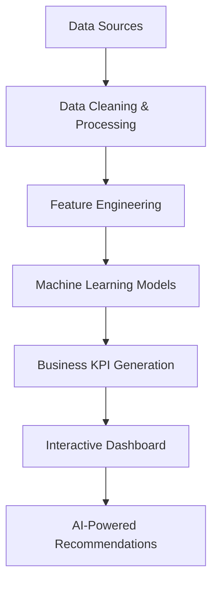

# RevenueIQ AI – AI-Powered Business Growth Platform

## Overview

RevenueIQ AI is an end-to-end business analytics platform designed to help organizations make smarter revenue, customer, demand, and inventory decisions.

The platform combines Business Intelligence, Machine Learning, Forecasting, and Generative AI to transform raw business data into actionable insights through an interactive executive dashboard.

Built with a business-first approach, RevenueIQ AI enables decision-makers to monitor performance, identify opportunities, forecast future demand, and receive AI-generated recommendations from a single platform.

---

## Business Problem

Modern businesses generate large amounts of operational data but often struggle to convert that data into meaningful decisions.

Key challenges include:

* Understanding revenue performance
* Predicting future demand
* Identifying high-value customers
* Monitoring inventory health
* Generating executive-level business insights
* Making data-driven decisions quickly

RevenueIQ AI addresses these challenges through a unified analytics and intelligence platform.

---

## Key Features

### Executive Command Center

A centralized dashboard providing a high-level business overview.

Features:

* Revenue monitoring
* Profit tracking
* Customer analytics
* Business health indicators
* Executive summaries
* Operational alerts

---

### Demand Intelligence

Machine Learning-based demand forecasting module.

Features:

* Sales forecasting
* Demand trend analysis
* Growth projections
* Forecast confidence tracking
* Inventory planning support

---

### Revenue Intelligence

Revenue analytics and growth optimization module.

Features:

* Revenue trend monitoring
* Profitability analysis
* Revenue driver identification
* Business performance evaluation
* Growth opportunity discovery

---

### Customer Insights

Advanced customer intelligence and segmentation.

Features:

* Customer segmentation
* VIP customer identification
* Revenue contribution analysis
* Customer value assessment
* Retention strategy recommendations

---

### Inventory Analytics

Inventory monitoring and risk management system.

Features:

* Inventory health monitoring
* Stock risk detection
* Reorder analysis
* Supplier performance tracking
* Inventory optimization recommendations

---

### AI Business Consultant

Generative AI-powered business assistant.

Features:

* Natural language business queries
* Executive summaries
* Strategic recommendations
* Revenue insights
* Customer insights
* Inventory intelligence

Example Questions:

* What is driving revenue growth?
* Which customer segment should we target?
* Is inventory healthy?
* What actions should management take?
* Give me an executive business summary.

---

## Technology Stack

### Programming

* Python

### Data Analysis

* Pandas
* NumPy

### Machine Learning

* Scikit-Learn
* XGBoost

### Forecasting

* Prophet

### Data Visualization

* Plotly
* Matplotlib

### Dashboard

* Streamlit

### Database

* MySQL

### AI Integration

* Google Gemini API

### Deployment

* Docker
* Streamlit Cloud 

---

## Project Architecture



---

## Dashboard Modules

* Executive Command Center
* Demand Intelligence
* Revenue Intelligence
* Customer Insights
* Inventory Analytics
* AI Business Consultant

---

## Installation

Clone the repository:

```bash
git clone https://github.com/vijayendravarma111/RevenueIQ-AI.git
cd RevenueIQ-AI
```

Install dependencies:

```bash
pip install -r requirements.txt
```

Run the application:

```bash
streamlit run app.py
```

---

## Future Enhancements

* Real-time business monitoring
* Automated anomaly detection
* Revenue optimization engine
* Dynamic pricing recommendations
* Multi-company support
* Cloud deployment architecture
* Advanced executive reporting

---

## Project Highlights

* End-to-End Data Science Project
* Business Intelligence Dashboard
* Demand Forecasting with Machine Learning
* Customer Segmentation Analytics
* Inventory Optimization
* AI-Powered Business Consulting
* Enterprise-Style Streamlit Application

---

## Author

Samudrala Vijayendra Varma

B.Tech Computer Science Engineering

Passionate about Data Science, Machine Learning, Analytics, and AI-powered Business Solutions.
