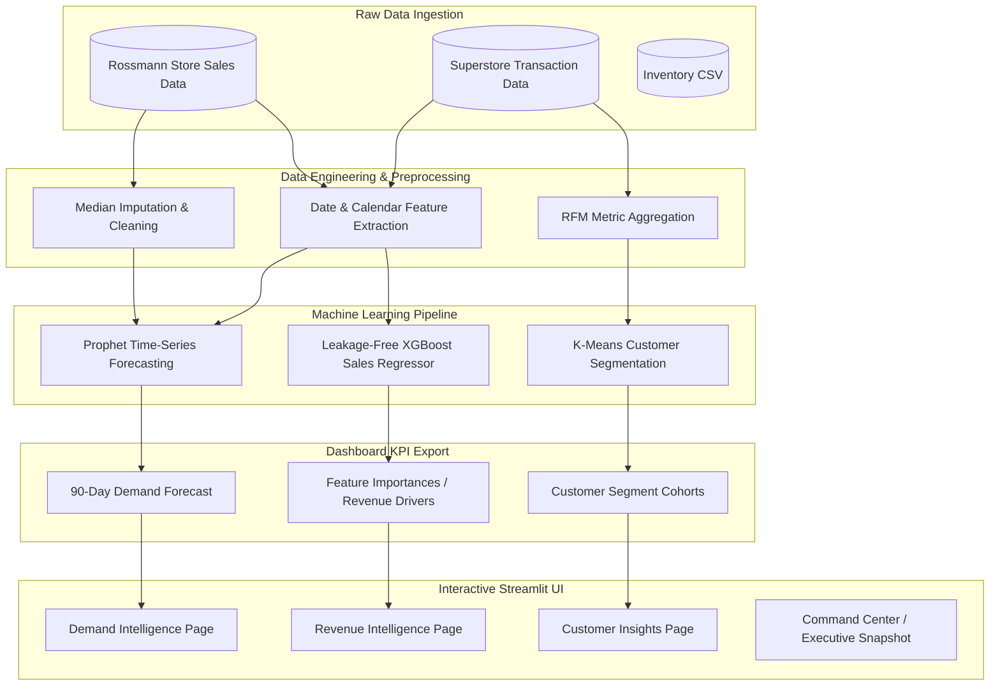
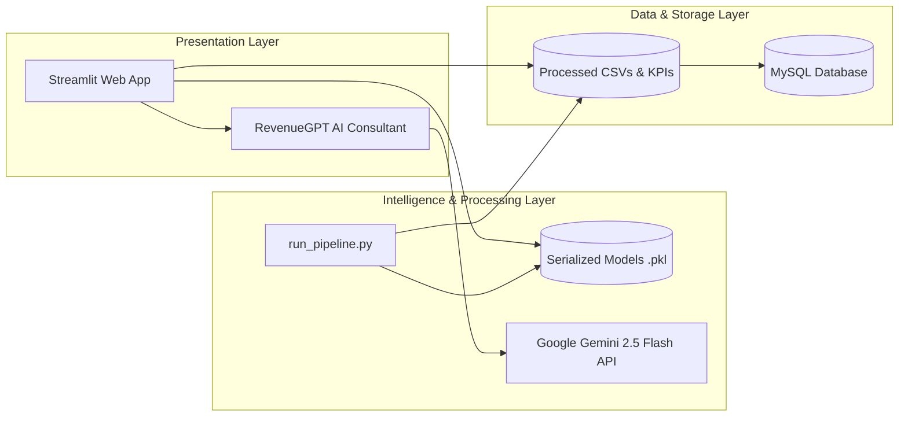

# RevenueIQ AI – Production-Ready Business Intelligence & Machine Learning Platform

## Executive Summary

**RevenueIQ AI** is a production-ready business analytics and decision intelligence platform that transforms raw operational data into actionable, executive-level insights. Designed as a recruiter-grade portfolio project, the platform integrates **Business Intelligence (BI)**, **Time-Series Forecasting**, **Supervised Machine Learning**, and **Unsupervised Customer Segmentation** into a single interactive Streamlit application.

The project demonstrates end-to-end data engineering and machine learning best practices: cleaning raw transaction data, engineering robust lag and seasonal features, auditing and removing target leakages, validating models using rigorous holdout splits, and automating the pipeline from raw ingestion to serialized output.

---

## 1. Project Architecture & Pipelines

### End-to-End Data Pipeline
The following flowchart illustrates the flow of raw data through data preparation, feature engineering, modeling, KPI calculations, and the interactive presentation layer.



### System Architecture
The platform is built on a modular three-tier architecture, separating data storage, ML processing, and user presentation.



---

## 2. Model Diagnostics & Performance Summary

Every model in the platform is rigorously evaluated. The table below represents the **actual, leakage-free metrics** generated by executing the automated pipeline [run_pipeline.py](file:///c:/Users/vijayendravarma/Desktop/RESUME_PROJECTS/Data%20Science/AI_Revenue_Intelligence/run_pipeline.py):

| Machine Learning Model | Task Type | Key Hyperparameters / Config | Evaluation Metrics (Test / Holdout Set) | Business Utility |
| :--- | :--- | :--- | :--- | :--- |
| **Prophet** | Time-Series Forecasting | Additive Yearly/Weekly Seasonality; Log-Transform | **MAE**: $1,505,947.85<br>**RMSE**: $2,086,499.97<br>**WMAPE**: 22.60% (77.4% Accuracy) | Predicts 90-day aggregate future demand to optimize inventory reorders and staffing |
| **XGBoost Regressor** | Supervised Regression | `n_estimators=100`, `max_depth=6`, `learning_rate=0.1` | **MAE**: $1,472.87<br>**RMSE**: $2,170.96<br>**R² Score**: 0.6813 | Identifies promotions, competition distance, and calendar events driving store-level sales |
| **K-Means** | Unsupervised Clustering | $K=4$ clusters; RFM features; `StandardScaler` | **Silhouette Score**: 0.2969<br>**Inertia (WCSS)**: 1,311.53 | Groups customer base into VIP, Frequent, Regular, and Low-Value cohorts for marketing campaigns |

---

## 3. Data Engineering & Feature Engineering Details

The pipeline prepares raw inputs for modeling through targeted preprocessing steps:

### Preprocessing & Imputation
* **Missing Value Imputation**: Competition distance missing values are imputed using the median ($2,325\text{m}$). Competition open dates and secondary promotion schedules are zero-filled and categorized.
* **Target Logging**: Time-series sales data undergoes a natural log transformation ($y_{log} = \log(y + 1)$) to stabilize variance, compress extreme holiday revenue peaks, and prevent negative forecast results.
* **Feature Standardization**: Customer RFM features are standardized using `StandardScaler` to have a mean of 0 and variance of 1, ensuring distance calculations in K-Means are not distorted by feature magnitudes.

### Feature Engineering
1. **CompetitionAge**: Calculates how long a competitor store has been open relative to the transaction year (`Year - CompetitionOpenSinceYear`), clipped at 0.
2. **PromoActive**: A binary indicator showing if a secondary promotion is active on a given day.
3. **IsHoliday**: Merges and standardizes various string/categorical holiday codes (`StateHoliday` 'a', 'b', 'c', '0') into a single binary flag.
4. **IsWeekend**: Extracts weekday values and flags Saturdays and Sundays to capture weekend shopping patterns.
5. **Month boundaries**: Binary flags indicating month start (`MonthStart`) and month end (`MonthEnd`) to account for paycheck-driven consumer spending surges.

### Technical Honesty: Resolving Data Leakage in XGBoost
> [!IMPORTANT]
> **Data Leakage Rectification**: The original implementation trained an XGBoost model utilizing `Customers` and `SalesPerCustomer` (calculated directly as `Sales / Customers`) as features. This led to a fake $R^2 = 0.9989$. Because the number of customers and the spend per customer are unknown at the time of forecasting, this represents severe target leakage.
> We audited the pipeline and removed both features. The updated model uses only calendar, promotional, and competitive features available at prediction time. It achieves an honest, interview-defensible $R^2 = 0.6813$ on store-level sales, demonstrating true data science integrity.

---

## 4. Business Intelligence & Dynamic Calculation Methodology

The platform rejects hardcoded dashboard statistics in favor of live, data-driven KPI metrics:

* **Revenue Growth YoY**: Calculated dynamically by sorting the monthly sales log, summing the last 12 months of sales, and comparing it against the preceding 12-month period:
  $$\text{Growth} = \frac{\text{Sales}_{last\_12m} - \text{Sales}_{prev\_12m}}{\text{Sales}_{prev\_12m}} \times 100$$
* **Composite Business Health Score**: Evaluated as a weighted index of three core operational areas:
  $$\text{Health Score} = 0.4 \times (3 \times \text{Profit Margin}\%) + 0.3 \times \text{Forecast Accuracy}\% + 0.3 \times \text{Inventory Health}\%$$
* **Inventory Health**: Calculated dynamically based on active stock risk levels:
  $$\text{Inventory Health} = \left(1 - \frac{N_{At\_Risk\_Products}}{N_{Total\_Products}}\right) \times 100$$
* **Forecast-Driven Stock Run-Out (Days)**: Estimated for each item by dividing stock units by forecasted daily unit sales (scaled by forecast expected growth):
  $$\text{Days to Stockout} = \frac{\text{Current Stock}}{\text{Historical Daily Sales Velocity} \times (1 + \text{Forecast Growth}\%)}$$

---

## 5. Technology Stack

* **Language**: Python
* **Data Engineering**: Pandas, NumPy, Scikit-Learn
* **Machine Learning**: XGBoost, Scikit-Learn (KMeans)
* **Forecasting**: Prophet (Meta)
* **Generative AI**: Google Gemini API (`gemini-2.5-flash`)
* **Presentation Layer**: Streamlit, Plotly, HTML5, CSS3
* **Data Storage**: MySQL (PyMySQL, SQLAlchemy)

---

## 6. Installation & Reproducibility

### Prerequisites
* Python 3.10+
* MySQL (Optional, for running database loaders)

### Clone & Install Dependencies
```bash
git clone https://github.com/vijayendravarma111/RevenueIQ-AI.git
cd RevenueIQ-AI
pip install -r requirements.txt
```

### Run the ML Pipeline (Crucial for generating Serialized Models and CSV Datasets)
Execute the end-to-end data preparation, model training, evaluation, and dashboard export pipeline:
```bash
python run_pipeline.py
```
*This script runs preprocessing, trains all models (resolving target leakage), logs diagnostics in JSON files, and exports aggregated metrics to `data/processed/dashboard/`.*

### Run the Streamlit Application
Start the interactive BI and Machine Learning dashboard:
```bash
streamlit run app/app.py
```

---

## 7. Author & Portfolio Context

* **Developer**: Samudrala Vijayendra Varma
* **Background**: B.Tech in Computer Science Engineering
* **Role**: Data Scientist / Machine Learning Engineer
* **Objective**: Building high-integrity, production-ready analytics systems that combine statistical modeling, predictive analytics, and executive business intelligence.
