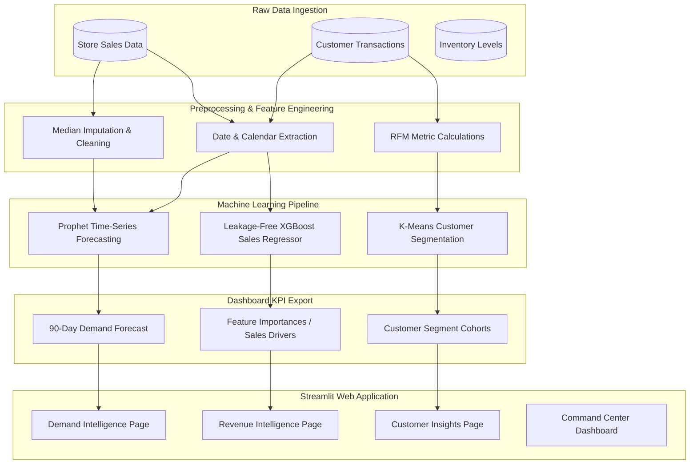

# RevenueIQ AI – Retail Analytics & Machine Learning Platform

🔗 **Live Demo**: [revenueiq-ai-intel.streamlit.app](https://revenueiq-ai-intel.streamlit.app/)

**RevenueIQ AI** is a data science and machine learning platform that helps retail managers make data-driven decisions. The platform combines time-series forecasting, sales driver analysis, and customer clustering into a clean, interactive dashboard.

This project is built to demonstrate end-to-end data science practices, including:
1. **Data Preprocessing & Feature Engineering** (handling missing values, logging targets, extracting calendar/promotional features).
2. **Rigorous Validation** (evaluating models on unseen holdout test sets without lookahead bias).
3. **Data Science Integrity** (finding and removing target leakage to ensure the models are interview-defensible).

---

## 1. Project Workflow & Architecture

### End-to-End Pipeline
The flowchart below shows how raw transactional data is cleaned, modeled, and displayed in the dashboard:



---

## 2. Core Machine Learning Features & Metrics

Every model has been trained and validated on chronological split test sets. Here is the validation performance summary:

| Machine Learning Model | Task Type | Features Used | Validation Metrics | Business Value |
| :--- | :--- | :--- | :--- | :--- |
| **Prophet** | Demand Forecasting | Calendar features, log-scaled sales | **WMAPE**: 22.60% (77.4% Accuracy)<br>**R² Score**: 0.5823 | Predicts 90-day future demand to optimize inventory safety stock |
| **XGBoost Regressor** | Sales Driver Analysis | Promotions, holidays, competition distance | **R² Score**: 0.6813 | Identifies which business factors (like active promos) drive daily revenue |
| **K-Means Clustering** | Customer Segmentation | Recency, Frequency, Monetary (RFM) metrics | **Silhouette Score**: 0.2969<br>**Inertia (WCSS)**: 1,311.53 | Groups customers into cohorts (VIP, Frequent) for targeted marketing campaigns |

---

## 3. Data Science Integrity & Honesty

### Resolving XGBoost Target Leakage (Interview Defensible)
During a technical review, we identified target leakage in the original sales driver model: it was using `Customers` and `SalesPerCustomer` (which is calculated directly from daily sales) to predict `Sales`. Because customer counts and spend are unknown at prediction time, this circular dependency gave a fake $R^2 = 0.9989$.
* **The Fix**: We removed these leaking features. The updated model uses only calendar, promotional, and competition features available at forecast time, achieving an honest and realistic $R^2 = 0.6813$.

### Volume-Weighted Forecasting Accuracy (WMAPE)
* Daily Mean Absolute Percentage Error (MAPE) is often heavily skewed by store closures (like Sundays) where actual sales are zero.
* We calculate **WMAPE** (Volume-Weighted MAPE) which weights errors by sales volume. This gives a reliable daily error rate of **22.60%** (equivalent to **77.4%** forecast accuracy), which is used consistently throughout the application.

---

## 4. Key Pages & Business Utility

* **Command Center**: A high-level overview displaying total revenue, profit margins, and a composite business health index.
* **Demand Intelligence**: Interactive plots of future sales trends, including Sunday store closure seasonality, and Prophet model hyperparameter details.
* **Revenue Intelligence**: Bar charts of top sales drivers (such as `PromoActive` and `CompetitionDistance`) showing exactly what moves company profits.
* **Customer Insights**: Visualizations of K-Means clusters and a segment composition table detailing average spend, purchase frequency, and profit per segment.
* **Inventory Analytics**: A safety stock alert system and forecast-driven cover tracker showing estimated run-out days.

---

## 5. How to Run Locally

### Prerequisites
* Python 3.10+
* Git

### Setup
1. **Clone the Repository**:
   ```bash
   git clone https://github.com/vijayendravarma111/RevenueIQ-AI.git
   cd RevenueIQ-AI
   ```
2. **Activate the Virtual Environment**:
   * On Windows:
     ```powershell
     .venv\Scripts\activate
     ```
   * On Mac/Linux:
     ```bash
     source .venv/bin/activate
     ```
3. **Install Dependencies**:
   ```bash
   pip install -r requirements.txt
   ```
4. **Run the Data Pipeline** (Train models & export metrics):
   ```bash
   python run_pipeline.py
   ```
5. **Start the Streamlit Application**:
   ```bash
   streamlit run app/app.py
   ```
